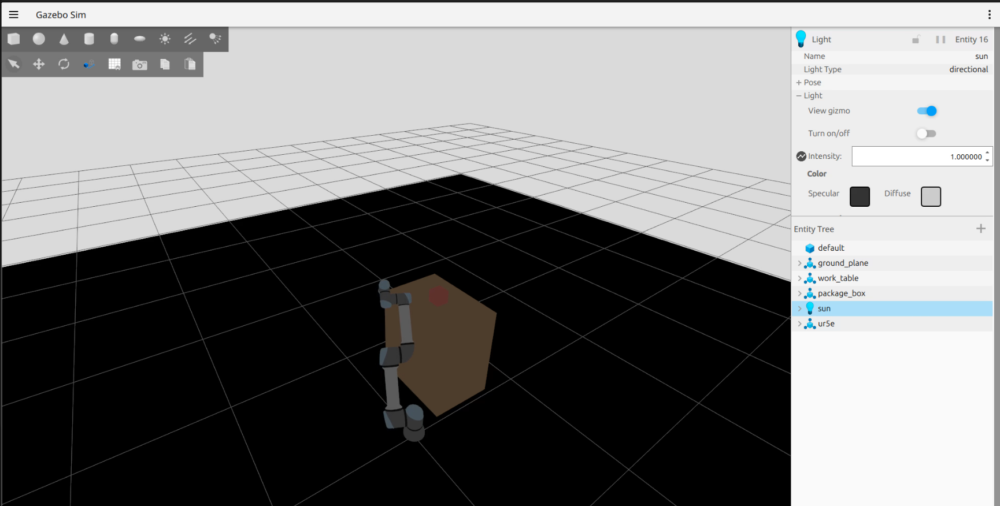

# UR5e Pick & Place — ROS2 Jazzy + Gazebo Harmonic

> Robotic pick and place simulation using a UR5e arm in ROS2 Jazzy and Gazebo Harmonic.  
> ROS2 Jazzy と Gazebo Harmonic を使用した UR5e アームによるピック＆プレースシミュレーション。

---

## 📹 Demo

https://github.com/AhmetEsme/robotic_pick_place_cell/raw/main/pick_place_demo.mp4



---

## 🇬🇧 English

### Overview

A full pick and place simulation built with ROS2 Jazzy and Gazebo Harmonic.  
The UR5e robot arm executes a 7-step motion sequence (Home → Pre-grasp → Grasp → Lift → Pre-place → Place → Post-place → Home) while a target box is transported from its start position on the floor to a work table using animated `gz service set_pose` calls synchronized with the arm motion via Python threading.

### Features

- UR5e arm controlled via `FollowJointTrajectory` action
- Smooth box transport animation using `gz service set_pose` + `threading`
- Kinematic box model (no physics interference during transport)
- Custom Gazebo world with ground plane, work table, and target box
- Fully configurable joint positions and box waypoints

### Stack

| Component | Version |
|---|---|
| ROS2 | Jazzy |
| Gazebo | Harmonic |
| ros2_control | Jazzy |
| Python | 3.12 |
| Ubuntu | 24.04 |

### Package Structure

```
robotic_pick_place_cell_ws/src/
├── pick_place_cell_bringup/        # ros2_control launch
├── pick_place_cell_description/    # URDF / Xacro for UR5e
├── pick_place_cell_gazebo/         # World SDF + Gazebo spawn launch
├── pick_place_cell_demo/           # Pick & place demo node
└── pick_place_cell_moveit_config/  # MoveIt2 config (optional)
```

### How to Run

```bash
# Terminal 1 — Launch Gazebo + UR5e + controllers
cd ~/robotic_pick_place_cell_ws
source /opt/ros/jazzy/setup.bash
source install/setup.bash
ros2 launch pick_place_cell_gazebo spawn_ur5e.launch.py

# Terminal 2 — Run the demo (after robot appears in Gazebo)
cd ~/robotic_pick_place_cell_ws
source /opt/ros/jazzy/setup.bash
source install/setup.bash
ros2 launch pick_place_cell_demo pick_place_demo.launch.py
```

> **Note:** Before each run, clean up any stale processes:
> ```bash
> pkill -9 -f gz && pkill -9 -f ros2 && pkill -9 -f ruby
> ```

### Build

```bash
cd ~/robotic_pick_place_cell_ws
colcon build --symlink-install
source install/setup.bash
```

---

## 🇯🇵 日本語

### 概要

ROS2 Jazzy と Gazebo Harmonic を使用した UR5e ロボットアームのピック＆プレースシミュレーションです。  
ロボットアームは 7 段階の動作シーケンス（Home → Pre-grasp → Grasp → Lift → Pre-place → Place → Post-place → Home）を実行し、その間にターゲットボックスが床上の初期位置から作業テーブルへ搬送されます。ボックスの搬送は `gz service set_pose` によるアニメーションと Python の `threading` を使いアームの動作に同期しています。

### 特徴

- `FollowJointTrajectory` アクションによる UR5e アーム制御
- `gz service set_pose` + `threading` を使用したスムーズなボックス搬送アニメーション
- キネマティックボックスモデル（搬送中に物理演算の干渉なし）
- グラウンドプレーン・作業テーブル・ターゲットボックスを含むカスタム Gazebo ワールド
- ジョイント角度およびボックス経由点を自由に設定可能

### 技術スタック

| コンポーネント | バージョン |
|---|---|
| ROS2 | Jazzy |
| Gazebo | Harmonic |
| ros2_control | Jazzy |
| Python | 3.12 |
| Ubuntu | 24.04 |

### パッケージ構成

```
robotic_pick_place_cell_ws/src/
├── pick_place_cell_bringup/        # ros2_control 起動
├── pick_place_cell_description/    # UR5e の URDF / Xacro
├── pick_place_cell_gazebo/         # ワールド SDF + Gazebo スポーン起動
├── pick_place_cell_demo/           # ピック＆プレースデモノード
└── pick_place_cell_moveit_config/  # MoveIt2 設定（オプション）
```

### 実行方法

```bash
# ターミナル1 — Gazebo + UR5e + コントローラ起動
cd ~/robotic_pick_place_cell_ws
source /opt/ros/jazzy/setup.bash
source install/setup.bash
ros2 launch pick_place_cell_gazebo spawn_ur5e.launch.py

# ターミナル2 — デモ実行（Gazebo にロボットが表示されてから）
cd ~/robotic_pick_place_cell_ws
source /opt/ros/jazzy/setup.bash
source install/setup.bash
ros2 launch pick_place_cell_demo pick_place_demo.launch.py
```

> **注意:** 実行前に古いプロセスをクリーンアップしてください：
> ```bash
> pkill -9 -f gz && pkill -9 -f ros2 && pkill -9 -f ruby
> ```

### ビルド

```bash
cd ~/robotic_pick_place_cell_ws
colcon build --symlink-install
source install/setup.bash
```

---

*Built with ROS2 Jazzy · Gazebo Harmonic · Python 3.12*
